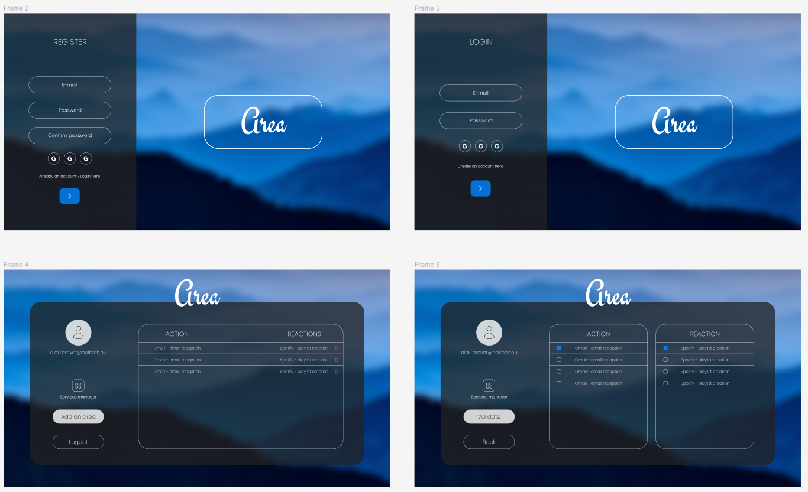
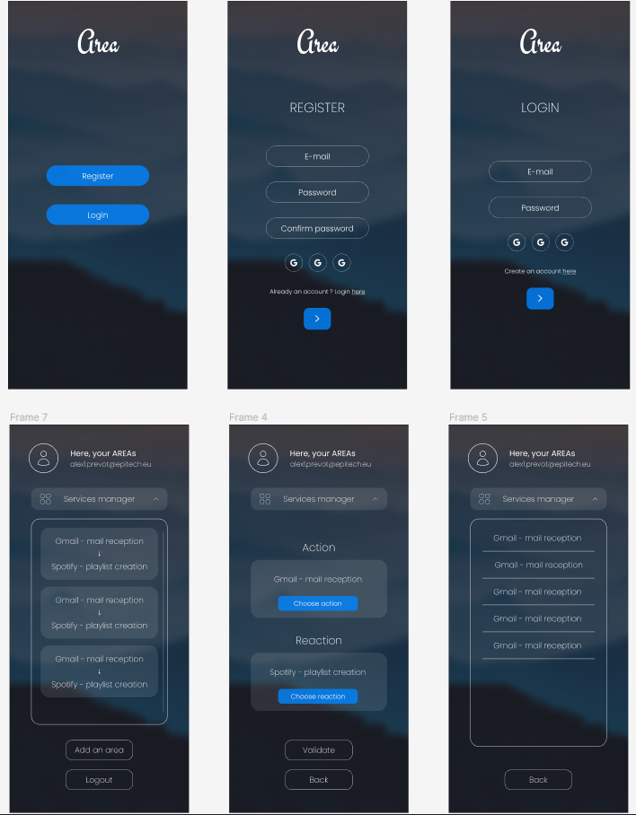

    
    

# Project Description

The objective of this project is to develop an application by exploring and understanding a chosen software platform. The application will function similar to that of IFTTT and Zapier, and it will be divided into three parts: an application server, a web client, and a mobile client.

# Functions

The application will provide the following functionalities:

    • User registration to create an account
    • Account confirmation to access the application
    • Subscription to services by the authenticated user
    • Services will offer the following components:
        • Action type
        • REAction type
    • Composing AREA by connecting previously configured Action to REAction
    • Triggering AREA automatically through triggers

# Project Setup

The project will be structured as follows:

    • A server service to launch the application server on port 8080
    • A client_mobile service to build the mobile client
    • A client_web service to launch the web client on port 8081
    • The services client_mobile and client_web will share a common volume
    • The client_mobile service will edit the associated binary and put it on the common volume with the client_web
    • The server service will run by exposing the port 8080
    • The server service will respond to the request http://localhost:8080/about.json (see File about.json)
    • The client_web service will run by exposing the port 8081
    • The client_web service will respond to one of the following queries:
        • http://localhost:8081/client.apk to provide the Android version of mobile client

To begin, populate the environment variables using the env.example files as example.
These files can be found in the following directories:

`./`
`mobile/`
`Backend/`

Once the environment variables have been filled, launch the application using `sudo docker compose up --build`.
